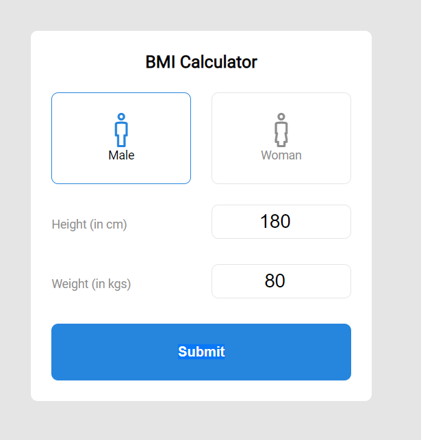

## BMI calculator - PHP, SCSS, Figma

Hi! I'm Florin Matei and you can see my entire work on **https://pixeltime.ro/**. I hope it will be useful that script for your project. 

## Files
BMI calculator

 1. PHP file (index.php) 
 2. SCSS file (style.scss, also we have style.css and styles.css.map) 
 3. Figma file (BMI Calculator.fig)

## Figma Design

The User Interface Design is created using Figma. Also, in that repository you will find the .fig file (Figma file exported). If you want to update my design, enjoy it.

